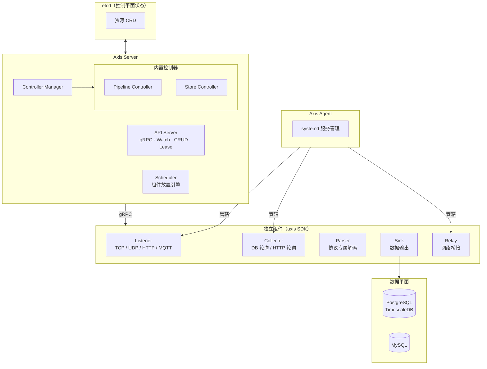

<p align="center">
  
</p>

<p align="center">
  <strong>Axis（枢界）</strong>
</p>

<p align="center">
  基于控制平面模型的声明式物联网数据平台。
</p>

<p align="center">
  <a href="https://golang.org" title="Go"></a>
  <a href="https://www.mozilla.org/en-US/MPL/2.0/" title="License"></a>
  <a href="https://github.com/keveon/axis/releases" title="Release"></a>
</p>

---

## Axis 是什么？

**Axis（枢界）** 是一个声明式物联网数据平台，将 **Kubernetes 控制平面模型** 应用于遥测数据接入、协议解析和数据管道编排。

不再编写将协议解析器、数据路由器、存储输出耦合在同一个进程中的单体集成程序。Axis 将一切拆解为 **独立、可插拔的组件**，由轻量级控制平面统一协调。你只需用 YAML 声明数据流、协议绑定和存储目标 — Axis 负责将声明驱动为现实。

**观测数据。路由流量。持久化结果。**

## 为什么需要 Axis？

物联网平台反复面临相同的挑战：协议碎片化（SL651、HJ212、Modbus、MQTT、私有协议）、脆弱的点对点集成、以及部署被锁定在单台机器上。

Axis 通过与 Kubernetes 相同的思路来解决这个问题 — 分离控制与执行：

- **控制平面与数据平面分离** — 配置与协调存储在 etcd 中；遥测数据通过专用可插拔组件流转
- **声明式，非命令式** — 描述你想要的（YAML 资源），而非如何连接它们
- **插件原生** — 每个协议解析器、数据输出端、数据接入端都是使用 Axis SDK 的独立二进制；核心保持最小化
- **单一二进制，三种角色** — `server`、`agent` 和 `worker` 共享一个二进制；按需部署任意组合
- **裸机友好** — 基于 systemd 运行，无需 Kubernetes；需要时可扩展为多机部署

## 架构



### 角色

| 角色 | 子命令 | 职责 |
|---|---|---|
| **Server** | `axis server start` | 控制平面 — API Server、Scheduler、Controller Manager 三合一 |
| **Agent** | `axis agent start` | 机器注册、systemd 服务生命周期管理 |
| **Worker** | `axis worker start` | 通用存储进程 — schema 管理、连接池、读写接口 |

三种角色打包在同一个二进制中，按拓扑需求灵活部署。

## 资源类型

Axis 通过声明式 YAML 资源来建模你的数据基础设施：

### 声明式资源（由控制器管理）

| 资源 | 描述 |
|---|---|
| **Protocol** | 协议识别规则（魔数字节、正则、组合规则），用于识别传入数据的格式 |
| **Pipeline** | 端到端数据流编排 — 从数据源经可选解析到一个或多个输出端 |
| **Store** | 存储目标声明（PostgreSQL、MySQL、TimescaleDB），包含 schema、迁移和连接池 |

### 组件资源（向 Server 注册的独立二进制）

| 资源 | 描述 |
|---|---|
| **Listener** | 被动数据接入 — TCP、UDP、HTTP、MQTT 端点，接收传入的遥测数据 |
| **Collector** | 主动数据采集 — 数据库查询、HTTP 轮询、文件监听等定时任务 |
| **Parser** | 协议专属解码器 — 将原始字节转换为结构化数据（如 SL651、HJ212、Modbus） |
| **Sink** | 数据输出 — 将结构化数据写入 Store 或外部系统 |
| **Relay** | 网络桥接 — 连接内外网网段，支持分布式部署 |

### Pipeline 示例

```yaml
apiVersion: axis.io/v1alpha1
kind: Pipeline
metadata:
  name: telemetry-ingest
spec:
  source:
    listenerRef: tcp-listener-9501
    protocolHints:
      - sl651
      - nwjc
  parse:
    protocolRef: sl651
    parserRef: sl651-parser
  sinks:
    - match:
        stationType: river
      sinkRef: warehouse-sink
      mapping:
        table: water_river_observations
    - match:
        stationType: groundwater
      sinkRef: warehouse-sink
      mapping:
        table: water_groundwater_observations
    - match: {}
      sinkRef: archive-sink
```

## 快速开始

### 安装

```bash
# 从源码构建
git clone https://github.com/keveon/axis.git
cd axis
go build -o axis ./cmd/axis

# 或下载预编译二进制
# curl -fsSL https://github.com/keveon/axis/releases/latest/download/axis-$(uname -s)-$(uname -m).tar.gz | tar xz -C /usr/local/bin
```

### 单机部署

```bash
# 1. 生成默认配置
sudo axis config generate --role server --output /etc/axis/config.yaml

# 2. 安装为 systemd 服务
sudo axis service install --role server
sudo systemctl enable --now axis-server

# 3. 应用你的第一个 Pipeline
axis apply -f - <<'EOF'
apiVersion: axis.io/v1alpha1
kind: Protocol
metadata:
  name: sl651
spec:
  detection:
    type: magic_bytes
    rules:
      - offset: 0
        value: "0x7e7e"
        length: 2
EOF

axis apply -f my-pipeline.yaml
```

### 多机部署

```bash
# 机器 A — 控制平面
sudo axis config generate --role server --output /etc/axis/config.yaml
sudo axis service install --role server
sudo systemctl enable --now axis-server

# 机器 B — 数据节点
sudo axis config generate --agent \
  --server-endpoint machine-a:5000 \
  --labels zone=external \
  --output /etc/axis/config.yaml
sudo axis service install --role agent
sudo systemctl enable --now axis-agent
```

### CLI 概览

```bash
axis server start                   # 启动控制平面
axis agent start                    # 启动机器代理
axis worker start                   # 启动 Worker

axis config generate --role server  # 生成默认配置
axis config show                    # 查看当前生效配置
axis service install --role server  # 注册为 systemd 服务

axis get stores                     # 列出存储资源
axis get pipelines                  # 列出管道资源
axis get nodes                      # 列出已注册机器
axis apply -f manifest.yaml         # 应用资源声明
axis delete pipeline telemetry      # 删除资源
axis logs <component>               # 查看组件日志
axis version                        # 打印版本信息
```

## 工作原理

1. **声明** — 编写 YAML 资源定义协议、管道、存储和组件绑定
2. **应用** — `axis apply` 将资源写入 etcd
3. **调和** — 控制器 Watch etcd，将实际状态驱动至期望状态（创建 systemd 服务、执行数据库迁移、建立数据路由）
4. **流转** — 独立二进制（Listener、Parser、Sink）向 Server 注册，通过管道接收数据，通过 Store 持久化

Server 从不直接接触遥测数据 — 它只负责协调。实际数据通过 Axis SDK 定义的 gRPC 接口在组件之间流转。

## 贡献

欢迎贡献！请阅读 [CONTRIBUTING.md](./CONTRIBUTING.md) 了解指南。

## 许可证

Axis（枢界）基于 [Mozilla Public License 2.0](https://www.mozilla.org/en-US/MPL/2.0/) 发布。
